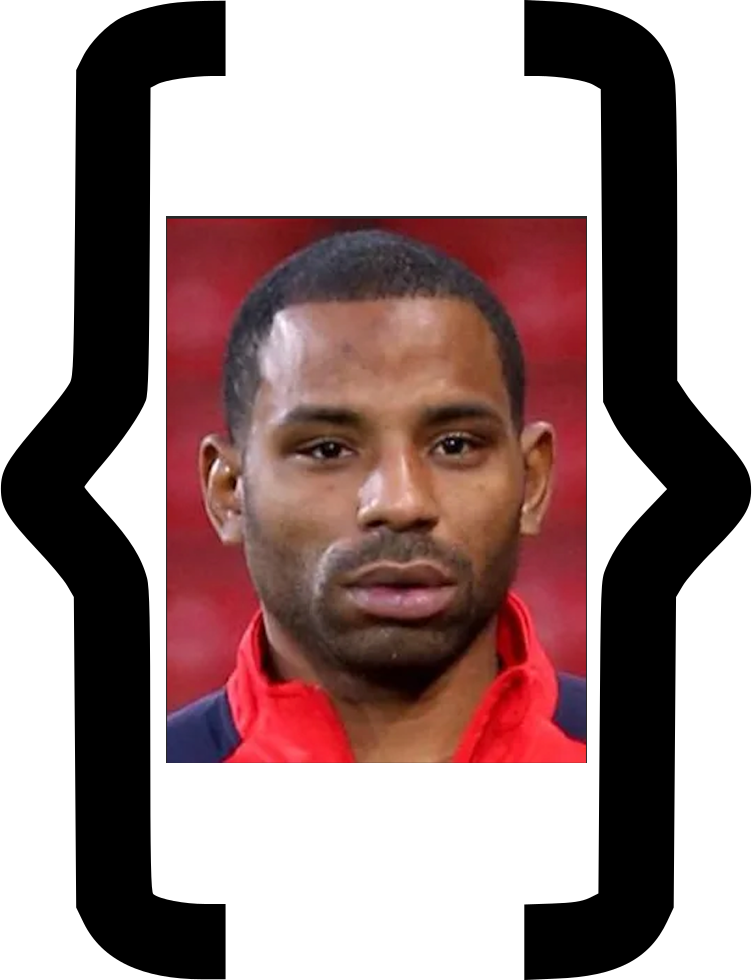

# JSON Puncheon



The JSON Puncheon repo is a blog and hub site for various football related apps that I have developed as a means to learn programming through the medium of football. This will also serve as a code portfolio and a route through to my [GitHub](https://github.com/raysmith745) and [LinkedIn](https://www.linkedin.com/in/ray-smith-23ab02bb/) accounts.

It uses [TypeScript](https://www.typescriptlang.org/), [React](https://react.dev/), [TailwindCSS](https://tailwindcss.com/) and [Vite](https://vite.dev/), and the site itself can be found hosted on Github Pages [here](https://raysmith745.github.io/json-puncheon).

## Repo Setup

Pull the repo down from GitHub:

```
git clone git@github.com:raysmith745/json-puncheon.git
```

Ensure Node Version Manager is installed and then use the version of Node defined in .nvmrc:

```
nvm use
```

Install packages:

```
npm install
```

Compile and build the app to the `dist` folder:
```
npm run build
```

Spin up the app locally:
```
npm run dev
```

Check linting:

```
npm run lint
```

Security vulnerability check:
```
npm audit
```

Once your changes have gone into main, this command will compile and build the app and deploy it to GitHub pages if the build passes:
```
npm run deploy
```
